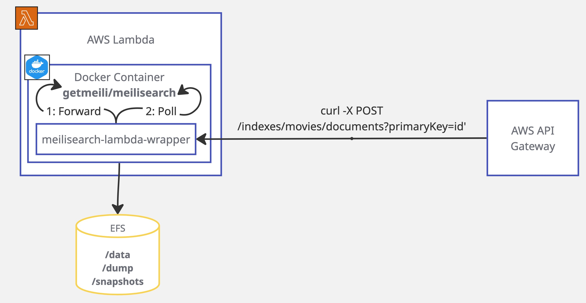

# Meilisearch Lambda Wrapper

Wrapping the asynchronous Meilisearch API to run on AWS Lambda with EFS storage.

## The Problem

Meilisearch is mainly [asynchronous](https://www.meilisearch.com/docs/learn/async/asynchronous_operations), and
is [designed](https://www.meilisearch.com/docs/learn/self_hosted/getting_started_with_self_hosted_meilisearch) to run on
a server that is always on.

To experiment with cost optimizations, we would like to run it on a Lambda function, which is ephemeral and may be shut
down at any time, backed by EFS for perpetual storage of the graph data itself.

## The solution

This project provides a wrapper around Meilisearch that allows it to run on an EFS-linked Lambda function, by wrapping
the asynchronous calls in a wrapper that waits for the operations to complete before returning.

Find an example Terraform setup for AWS Lambda + EFS in the [`docs/`](docs/terraform_example/README.md) folder.

## Does it work?

It works on my machine :man_shrugging:. Not entirely sure about multiple concurrent requests. This is a proof of
concept. [Contributions are welcome](CONTRIBUTING.md)!
