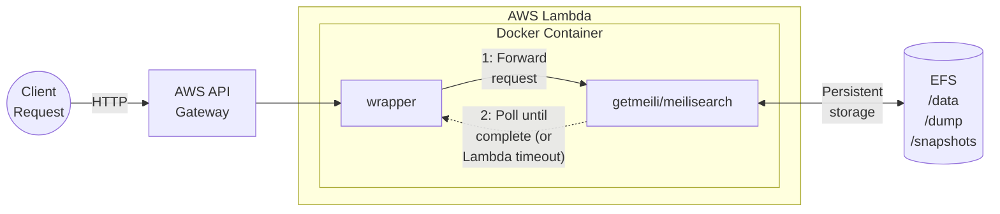

# Meilisearch Lambda Wrapper

> Run [Meilisearch](https://www.meilisearch.com/) as a serverless full-text search engine on **AWS Lambda**, with
> persistent storage on **Amazon EFS**.

[](https://github.com/alchemaxinc/meilisearch-lambda-wrapper/releases)

Meilisearch is a powerful open-source search engine, but it is designed for long-running servers.
This project makes it possible to **self-host Meilisearch on AWS Lambda** by providing a lightweight
Rust proxy that intercepts asynchronous index-write operations and waits for them to complete before
returning — turning ephemeral Lambda invocations into a viable runtime for Meilisearch.

**Who is this for?** Developers and small teams looking for a low-cost, serverless alternative to
Meilisearch Cloud, Algolia, or a dedicated EC2/ECS instance, especially for side projects,
internal tools, or low-to-moderate traffic workloads.

## Quick start

Pre-built binaries for `x86_64` and `aarch64` are published on every
[GitHub Release](https://github.com/alchemaxinc/meilisearch-lambda-wrapper/releases).

Create a `Dockerfile` for your Lambda function:

```dockerfile
FROM alpine:3.21 AS fetcher

ARG TARGETARCH
ARG WRAPPER_VERSION=2.0.4

RUN apk add --no-cache curl && \
    case "${TARGETARCH}" in \
      amd64) RUST_TARGET="x86_64-unknown-linux-musl" ;; \
      arm64) RUST_TARGET="aarch64-unknown-linux-musl" ;; \
      *) echo "Unsupported architecture: ${TARGETARCH}" && exit 1 ;; \
    esac && \
    curl -fsSL -o /wrapper \
      "https://github.com/alchemaxinc/meilisearch-lambda-wrapper/releases/download/v${WRAPPER_VERSION}/wrapper-${RUST_TARGET}" && \
    chmod +x /wrapper

FROM getmeili/meilisearch:v1.41.0

WORKDIR /app

COPY --from=fetcher /wrapper ./wrapper
COPY --from=public.ecr.aws/awsguru/aws-lambda-adapter:1.0.0 /lambda-adapter /opt/extensions/lambda-adapter

ENTRYPOINT ["/app/wrapper"]
```

Pin the wrapper version with a build arg:

```sh
docker build --build-arg WRAPPER_VERSION=1.2.3 .
```

### Verifying checksums

Each release includes `.sha256` files per binary:

```sh
curl -fsSL -O https://github.com/alchemaxinc/meilisearch-lambda-wrapper/releases/download/v2.0.4/wrapper-x86_64-unknown-linux-musl{,.sha256}
sha256sum -c wrapper-x86_64-unknown-linux-musl.sha256
```

### Minimum deployment requirements

- An **AWS Lambda** function using a **container image**
- **[Lambda Web Adapter](https://github.com/awslabs/aws-lambda-web-adapter)** (`AWS_LWA_PORT=8080`)
- An **Amazon EFS** file system mounted to the Lambda for persistent index storage
- Meilisearch data directories (`/data`, `/dump`, `/snapshots`) pointing at the EFS mount
- A **master key** passed via the `MEILI_MASTER_KEY` environment variable

An example Terraform setup covering all of the above is available in the
[`docs/terraform_example/`](docs/terraform_example/README.md) folder.

## Architecture


```mermaid
flowchart LR
    Request(("Client<br/>Request")) -->|HTTP| Gateway["AWS API<br/>Gateway"]
    Gateway --> Wrapper

    subgraph Lambda["AWS Lambda"]
        subgraph Docker["Docker Container"]
            Wrapper["wrapper"] -->|"1: Forward<br/>request"| Meili["getmeili/meilisearch"]
            Meili -.->|"2: Poll until<br/>complete (or<br/>Lambda timeout)"| Wrapper
        end
    end

    Meili <-->|"Persistent<br/>storage"| EFS[("EFS<br/>/data<br/>/dump<br/>/snapshots")]
```

## Can Meilisearch run on AWS Lambda?

Yes — but not out of the box. Meilisearch is primarily
[asynchronous](https://www.meilisearch.com/docs/learn/async/asynchronous_operations): write
operations (adding documents, updating settings, creating indexes) return a task ID immediately
and process the work in a background queue. On a traditional server, this is fine — the process
stays alive. On AWS Lambda, the function may be frozen or terminated before Meilisearch finishes
processing the queued task. Read operations (search queries) work fine, but writes will silently
fail.

Simply placing Meilisearch behind the
[Lambda Web Adapter](https://github.com/awslabs/aws-lambda-web-adapter) is **not enough** to
solve this. The adapter handles HTTP routing, but does nothing about the async write gap.

This wrapper solves the problem by sitting between the Lambda Web Adapter and Meilisearch,
intercepting `POST` requests to `/indexes/*` (document additions, setting updates, etc.),
forwarding them to Meilisearch, and then **polling the task endpoint until the operation
completes** before returning the response. The Lambda invocation stays alive for exactly as long
as the write needs.

All other requests — searches, GETs, DELETEs — are proxied through untouched with minimal overhead.

## Why serverless Meilisearch?

Running a full-text search engine typically means paying for an always-on server or a managed
service. For many use cases that's overkill:

- **Side projects and portfolios** that get a handful of searches a day
- **Internal tools** used during business hours only
- **Staging environments** that sit idle most of the time
- **Prototyping** where you want instant full-text search without committing to infrastructure

AWS Lambda's generous free tier (1 million requests/month) combined with EFS for persistent
storage makes it possible to run a self-hosted Meilisearch instance for **near-zero cost** at
low traffic volumes, scaling up automatically when needed.

## How the wrapper works

The wrapper is a small, fast Rust binary (~3 MB)
that runs as the container's entrypoint. On startup it:

1. **Launches Meilisearch** as a child process (listening on `localhost:7700`)
2. **Starts an HTTP proxy** on port `8080` (where Lambda Web Adapter forwards traffic)
3. **Proxies all requests** to Meilisearch, with special handling for index writes:
    - Intercepts `POST /indexes/*` requests
    - Forwards the request to Meilisearch and captures the returned `taskUid`
    - Polls `GET /tasks/{taskUid}` until the task reaches a terminal state (`succeeded`, `failed`,
      or `canceled`)
    - Returns the final task result synchronously to the caller

This means your application code doesn't need to change — just point it at the Lambda URL instead
of a Meilisearch server and writes will behave synchronously.

## Features

- **Synchronous index writes** — document additions, updates, deletions, and setting changes
  complete before the Lambda returns
- **Pre-built multi-arch binaries** — `x86_64` and `aarch64` with SHA-256 checksums
- **Terraform IaC example** — production-ready AWS Lambda + EFS + API Gateway setup
- **Configurable timeouts** — respects Lambda's own timeout with 1 second of headroom
- **Minimal overhead** — Rust binary adds ~3 MB and negligible latency to read operations
- **CORS preflight handling** — OPTIONS requests return `200` without hitting Meilisearch

## Configuration

All settings are via environment variables:

| Variable                       | Default      | Description                                               |
|--------------------------------|--------------|-----------------------------------------------------------|
| `MEILI_MASTER_KEY`             | _(required)_ | Meilisearch master key for authentication                 |
| `AWS_LAMBDA_TIMEOUT_SECONDS`   | `300`        | Lambda timeout; the wrapper stops polling 1 s before this |
| `MEILISEARCH_POLL_INTERVAL_MS` | `100`        | How often to poll a task's status during a write          |
| `MAX_REQUEST_BODY_SIZE_MB`     | `100`        | Maximum request body size accepted by the proxy           |
| `RUST_LOG`                     | `info`       | Log level (`debug`, `info`, `warn`, `error`)              |
| `AWS_LWA_PORT`                 | `8080`       | Must match the proxy's listen port (do not change)        |

Meilisearch's own environment variables (`MEILI_DB_PATH`, `MEILI_DUMP_DIR`, etc.) are passed
through to the child process. Point these at your EFS mount path.

## Infrastructure

The combination of **AWS Lambda + Amazon EFS** is central to this project. Lambda provides the
serverless compute, while EFS provides the persistent, shared file system that Meilisearch needs
for its database, dumps, and snapshots — surviving cold starts and scaling across concurrent
invocations.

The [`docs/terraform_example/`](docs/terraform_example/README.md) folder contains a complete,
documented Terraform project that provisions everything you need:

- **ECR** — container registry with lifecycle policy and bootstrap image
- **Lambda** — arm64 container function (512 MB) with EFS mount and all environment variables
- **EFS** — encrypted file system with access point and mount targets in every AZ
- **API Gateway** — REST API with proxy integration and CORS handling
- **IAM** — least-privilege roles for Lambda ↔ EFS ↔ ECR
- **Monitoring** — CloudWatch log metric filters, alarms, and SNS email alerts

See the [Terraform README](docs/terraform_example/README.md) for a step-by-step getting started
guide.

## When should I use this?

**Good fit:**

- Low-to-moderate traffic search workloads
- Side projects, internal tools, staging environments
- Cost-sensitive deployments where Lambda's free tier matters
- Prototyping with real full-text search before committing to infrastructure

**Not ideal for:**

- Use cases requiring sub-second cold starts
- Workloads where EFS latency on the initial index load is unacceptable (very large indexes)

This is a **proof of concept**. It works well for the use cases above.
[Contributions and feedback are welcome!](CONTRIBUTING.md)
