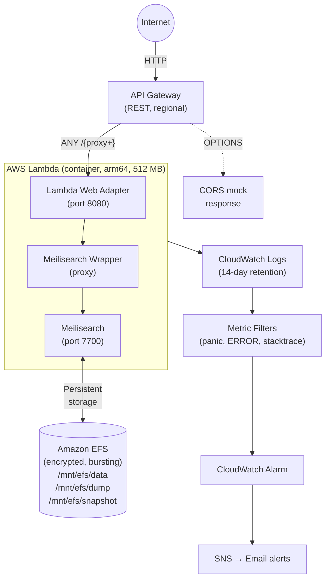

# Terraform Example: Meilisearch on AWS Lambda + EFS

This is a complete Terraform project that provisions the AWS infrastructure for running
Meilisearch on Lambda with persistent EFS storage. Use it as a starting point and adapt it to
your needs.

## What gets provisioned



### File overview

| File                        | Purpose                                                    |
| --------------------------- | ---------------------------------------------------------- |
| `backend.tf`                | S3 remote state with lock file                             |
| `provider.tf`               | AWS provider config and default tags                       |
| `variables.tf`              | Input variables with validation                            |
| `locals.tf`                 | Internal constants (EFS mount path, log filters)           |
| `terraform.tfvars`          | Example variable values (**do not commit real secrets**)   |
| `data.tf`                   | Lookups for default VPC, subnets, and security group       |
| `ecr.tf`                    | ECR repository, lifecycle policy, and bootstrap image      |
| `efs.tf`                    | EFS file system, mount targets (all AZs), and access point |
| `lambda_api_function.tf`    | Lambda function with EFS mount and env vars                |
| `lambda_api_role.tf`        | IAM role with EFS and ECR permissions                      |
| `lambda_api_logging.tf`     | CloudWatch log group, metric filters, and alarm            |
| `api_gateway_rest.tf`       | REST API Gateway with proxy integration and CORS           |
| `sns_metric_alert_topic.tf` | SNS topic and email subscription for alerts                |
| `outputs.tf`                | Lambda timeout and API Gateway invoke URL                  |

## Pre-requisites

- [Terraform](https://www.terraform.io/) ≥ 1.0
- AWS CLI configured with appropriate credentials
- Docker (for the ECR bootstrap image push during `terraform apply`)

### Create the S3 state bucket

The backend uses S3 for shared Terraform state. Create a bucket before running `terraform init`:

```bash
export AWS_REGION=<your-region>
export AWS_PROFILE=<your-profile>
```

```bash
aws s3api create-bucket \
  --bucket <some-unique-bucket-name> \
  --region $AWS_REGION \
  --create-bucket-configuration LocationConstraint=$AWS_REGION
```

Optionally enable versioning:

```bash
aws s3api put-bucket-versioning \
  --bucket <some-unique-bucket-name> \
  --versioning-configuration Status=Enabled
```

If deploying to multiple environments in separate AWS accounts, create a separate bucket per
environment (e.g. `myproject-terraform-dev`, `myproject-terraform-prod`).

## Getting started

### 1. Configure variables

Copy `terraform.tfvars` and fill in your values:

```hcl
service_name           = "my-meilisearch"
environment            = "development"
git_sha                = "abc123"
ecr_repository_name    = "my-meilisearch-api"
meilisearch_master_key = "a-strong-random-key"
```

| Variable                       | Required | Default | Description                                |
| ------------------------------ | -------- | ------- | ------------------------------------------ |
| `service_name`                 | yes      | —       | Used for naming all AWS resources          |
| `environment`                  | yes      | —       | `development` or `production`              |
| `git_sha`                      | yes      | —       | Version identifier for the deployment      |
| `ecr_repository_name`          | yes      | —       | ECR repository name for the Docker image   |
| `meilisearch_master_key`       | yes      | —       | Meilisearch authentication key (sensitive) |
| `api_lambda_timeout_seconds`   | no       | `120`   | Lambda timeout in seconds (1–900)          |
| `meilisearch_poll_interval_ms` | no       | `100`   | Wrapper poll interval in ms (1–5000)       |

### 2. Initialize and apply

```bash
terraform init -backend-config="bucket=<your-bucket-name>"
terraform plan
terraform apply
```

On first apply, Terraform will:

1. Create the ECR repository
2. Push a placeholder `hello-world` image to ECR (solves the chicken-and-egg problem — Lambda
   requires an image at creation time)
3. Create the EFS file system with mount targets in every AZ
4. Create the Lambda function pointing at the bootstrap image
5. Wire up API Gateway → Lambda

### 3. Deploy your real image

After `terraform apply` completes, build and push your actual Meilisearch wrapper image to the
ECR repository. The Lambda function has `ignore_changes = [image_uri]` set, so Terraform won't
overwrite your deployed image on subsequent runs — image deployments are handled by your CI/CD
pipeline.

```bash
# Build and push (example)
aws ecr get-login-password --region <region> | docker login --username AWS --password-stdin <account-id>.dkr.ecr.<region>.amazonaws.com
docker build -t <ecr-repo-url>:<tag> .
docker push <ecr-repo-url>:<tag>

# Update Lambda to use the new image
aws lambda update-function-code \
  --function-name <service-name>-api-<environment> \
  --image-uri <ecr-repo-url>:<tag>
```

### 4. Verify

The API Gateway invoke URL is printed as a Terraform output:

```bash
terraform output api_gateway_invoke_url
# → https://<api-id>.execute-api.<region>.amazonaws.com/default

curl "$(terraform output -raw api_gateway_invoke_url)/health"
# → {"status":"available"}
```

## Key design decisions

### Why EFS?

AWS Lambda's `/tmp` storage is ephemeral — it gets wiped when the execution environment is
recycled. Meilisearch needs persistent storage for its database files. EFS provides a shared,
persistent file system that Lambda can mount at `/mnt/efs`, keeping indexes intact across cold
starts and concurrent invocations.

The EFS configuration uses the cheapest options: **General Purpose** performance mode and
**Bursting** throughput. Files not accessed for 30 days are automatically transitioned to
Infrequent Access storage to reduce costs further.

### Why arm64?

The Lambda runs on AWS Graviton (`arm64`) processors, which are ~20% cheaper than x86 at the
same memory. The wrapper ships pre-built binaries for both architectures.

### Bootstrap image

Lambda requires a container image to exist in ECR at creation time. The `null_resource` in
`ecr.tf` solves this by pushing a `hello-world` placeholder during `terraform apply`. You then
deploy your real image via CI/CD without Terraform involvement.

### CORS handling

CORS preflight (`OPTIONS`) is handled at the API Gateway level using a mock integration — the
request never reaches Lambda, avoiding unnecessary invocations and cold starts.

### Monitoring

CloudWatch log metric filters watch for `panic`, `ERROR`, and `stacktrace` patterns in Lambda
logs. When any error is detected within an hour-long evaluation window, a CloudWatch Alarm fires
and sends a notification to an SNS topic. Update the email in `sns_metric_alert_topic.tf` to
receive these alerts.

## Customizing

- **Memory**: The Lambda is set to 512 MB, which is the minimum for stable Meilisearch
  operation. Increase it for larger indexes.
- **Timeout**: Default is 120 seconds. Increase `api_lambda_timeout_seconds` for large document
  imports. Note that API Gateway has a 29-second hard limit for synchronous responses — for
  longer operations, consider invoking Lambda asynchronously.
- **Region**: The provider defaults to `eu-north-1`. Change it in `provider.tf`.
- **VPC**: This example uses the default VPC and its security group. For production, consider a
  dedicated VPC with private subnets.
- **Alerts**: Update the email address in `sns_metric_alert_topic.tf` and confirm the SNS
  subscription via the email link AWS sends.

## Troubleshooting

### Terraform state lock errors

If you see `PreconditionFailed` errors related to the S3 state lock, force-unlock with the Lock
Info ID from the error message:

```bash
terraform force-unlock -force <lock-info-id>
```
